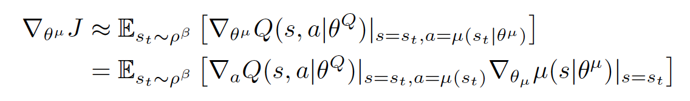
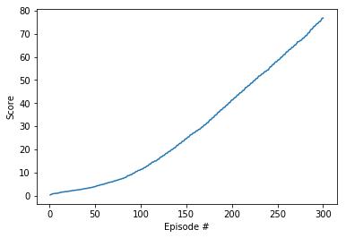

## Methodology

This work implements the DDPG algorithm (Deep Deterministic Policy Gradients) to the 20 agents Reacher environment, as described in [_Continuous Control with Deep Reinforcement Learning_][ddpg-paper] (Lillicrap et al). The foundation of this code-base is from the [Udacity DRL `ddpg-bipedal` notebook][ddpg-repo]

[ddpg-paper]: https://arxiv.org/pdf/1509.02971.pdf
[ddpg-repo]: https://github.com/udacity/deep-reinforcement-learning/blob/master/ddpg-bipedal/DDPG.ipynb

* As finding the greedy policy requires an optimization of at at every timestep, we can't apply Q-learning to continuous action spaces and also this optimization is too slow to be practical with large, unconstrained function approximators and nontrivial action spaces.

* Deep DPG (DDPG) is a model-free approach which can learn competitive policies for all of our tasks using low-dimensional observations. In many cases, we are also able to learn good policies directly from pixels

* A key feature of the approach is its simplicity: it requires only a straightforward actor-critic architecture and learning algorithm with very few “moving parts”, making it easy to implement and scale to more difficult problems and larger networks. 

* DDPG can sometimes find policies that exceed the performance of the planner, in some cases even when learning from pixels.

* The DPG algorithm came to rescue us by maintaing a parameterized actor function which specifies the current policy by deterministically mapping states to a specific action. The critic is learned using the Bellman equation as in Q-learning. The actor is updated by following the applying the chain rule to the expected return from the start distribution J with respect to the actor parameters:

* A major challenge of learning in continuous action spaces is exploration. An advantage of offpolicies algorithms such as DDPG is that we can treat the problem of exploration independently from the learning algorithm. We constructed an exploration policy by adding noise sampled from a noise process N to our actor policy.

## Implementation 

The network comprises of 2 networks:

* Actor: 256 -> 256

* Critic: 256 -> 256 -> 128

Hyperparameters:

replay buffer size = 1e6
minibatch size = 128
discount factor = 0.99
tau for soft update of target parameters = 1e-3
learning rate of the actor = 2e-4
learning rate of the critic = 2e-4
L2 weight decay = 0.0001

I've trained the network using DDPG algorithm with the state vector of size 33 and the output vector is of size 4 using Adam optimizer.

## Results 

The agents were able to solve task in 216 episodes with a final average score of 55.69 after 300 episodes.

## Enhancements

- Improving results tunning the networks scructures (adding layers or units per layers, ...)
- Implement PPO, D3PG or D4PG that probably  would produce better results

